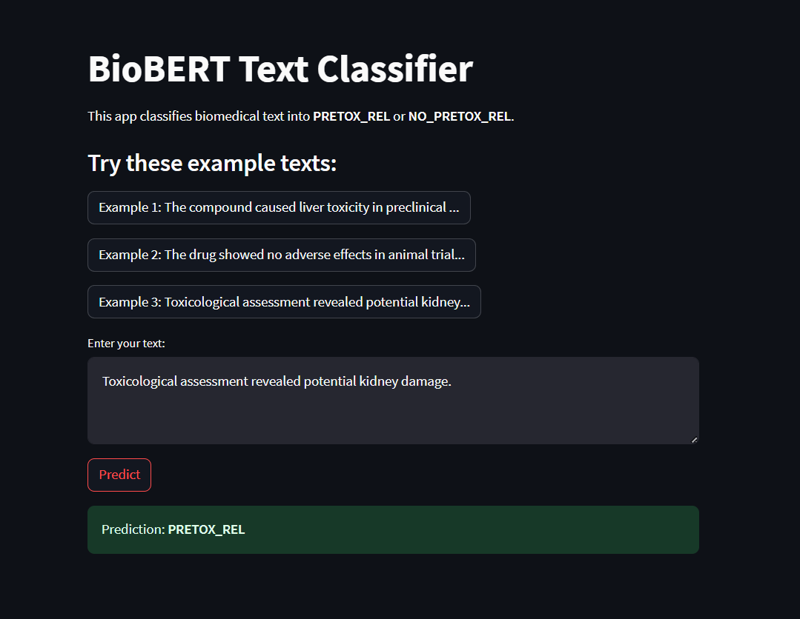
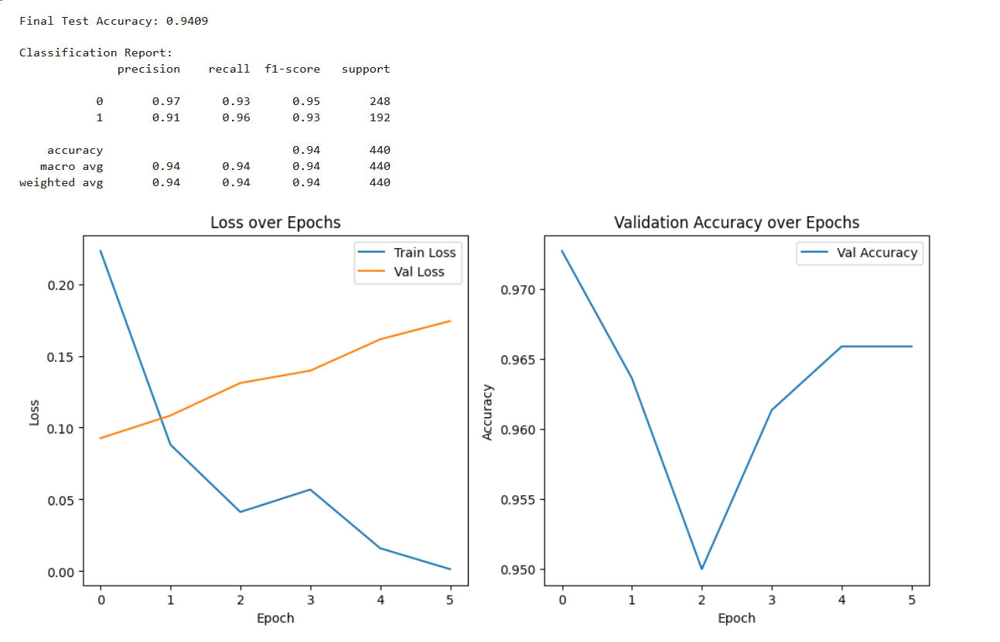

# PRETOX Text Classifier with BioBERT


A high-performance biomedical text classifier built with **BioBERT** to determine if a given text is related to **PRETOX** (Preclinical Toxicology). This tool is designed to help researchers efficiently sift through vast amounts of literature to find toxicology-relevant information.

---

## Key Features

- **High Accuracy**: Achieves **94% accuracy** on the test dataset, ensuring reliable classification.
- **Domain-Specific AI**: Utilizes **BioBERT**, a language model pre-trained on biomedical text, for nuanced understanding of scientific terminology.
- **Interactive Interface**: A simple and intuitive web application built with Streamlit allows for easy, code-free use by researchers and domain experts.
- **Reproducible**: The entire training and evaluation pipeline is available in a Jupyter Notebook for full transparency and custom experimentation.

---

## Live Demo

Here is a preview of the interactive Streamlit application. Users can input text directly or use the provided examples to get an instant classification.



---

## Model Performance

The model demonstrates strong performance in distinguishing between PRETOX-related and non-related texts.

**Final Test Accuracy**: **94%**

### Classification Report

| Class             | Precision | Recall | F1-Score |
| ----------------- | :-------: | :----: | :------: |
| `0 (NO_PRETOX_REL)` |   0.97    |  0.93  |   0.95   |
| `1 (PRETOX_REL)`  |   0.91    |  0.96  |   0.93   |

### Training & Validation Curves

The training history shows stable learning and good generalization from training to validation data.



---

## Getting Started

Follow these steps to set up and run the project locally.

### 1. Clone the Repository
```
git clone https://github.com/meetptl04/pretox-classifier.git
cd pretox-classifier
```

### 2\. Set Up a Virtual Environment

It is recommended to use a virtual environment to manage dependencies.

  - **Linux / macOS:**
    ```bash
    python3 -m venv venv
    source venv/bin/activate
    ```
  - **Windows:**
    ```bash
    python -m venv venv
    venv\Scripts\activate
    ```

### 3\. Install Dependencies

```bash
pip install -r requirements.txt
```

### 4\. Run the Streamlit App

```bash
streamlit run app.py
```

Navigate to the local URL provided in your terminal to start using the application.

-----

## Model & Dataset

  - **Model**: The classifier is a fine-tuned version of [**BioBERT (v1.1)**](https://huggingface.co/dmis-lab/biobert-v1.1), optimized for sequence classification. To review or retrain the model, please see the `NLP_BioBert_PRETOX_REL.ipynb` notebook.
  - **Dataset**: The model was trained on the [**pretoxtm-dataset**](https://huggingface.co/datasets/javicorvi/pretoxtm-dataset) from Hugging Face, which contains biomedical text excerpts labeled for toxicology relevance.

-----

## Project Structure

```
BioBert_app/
├── data/                    # Dataset files
├── model/                   # Trained model checkpoints
├── images/                  # Project images and screenshots
│   ├── accuracy.png
│   └── streamlit_app_image.png
├── venv/                    # Virtual environment (ignored by git)
├── app.py                   # Streamlit application source code
├── requirements.txt         # Required Python packages
└── NLP_BioBert_PRETOX_REL.ipynb # Notebook with training & evaluation code
```

-----
